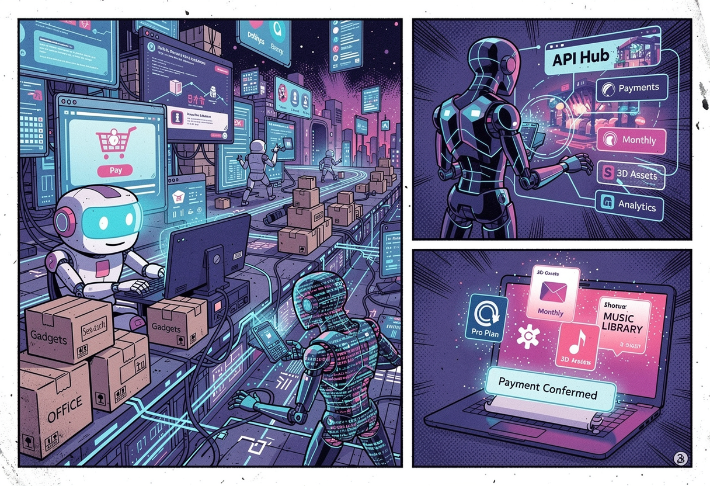

# AG Pay



**A human-supervised payment control plane for AI agents.**

## The vision

AI adoption is moving at extraordinary speed. Only a few years ago, many of us
were reluctant to accept a cookie banner. Today, we routinely invite AI into
our work, our ideas, and increasingly personal parts of our lives. For millions
of people, talking to an LLM has already become an everyday habit.

Yet even the most capable agent reaches a hard boundary when it needs to act in
the economy. It can research a product, compare providers, choose an API, or
recommend a subscription—but it cannot safely complete the next step on its
own. If agents are going to become genuinely useful collaborators, they need
more than intelligence. They need secure, accountable infrastructure for
economic action: buying goods, paying for APIs and services, managing
subscriptions, and requesting refunds.

We believe this missing payment layer should be designed around trust from the
beginning. Autonomy should be earned and configurable, important decisions
should remain visible, and people should always be able to understand which
agent spent what, where, and why.

## What we are building

AG Pay began as an experiment driven by curiosity: **what would a secure,
manageable wallet for AI agents actually look like?**

Giving an agent unrestricted access to a card is not an acceptable answer.
People need a way to set different rules for different agents, review sensitive
requests, share payment methods without losing accountability, and supervise
everything through an interface built for humans. Just as importantly, raw
card details must never be placed in an LLM prompt, context window, log, or
conversation.

AG Pay is exploring a control layer where:

- every agent has its own identity, permissions, and payment policy;
- cautious agents ask for approval while trusted agents can operate within
  narrower, explicitly defined rules;
- multiple agents can use the same approved payment method while every action
  remains attributable;
- humans can review proposals, approve or cancel them, and inspect purchase and
  subscription history in one place; and
- payment credentials stay behind provider boundaries, represented inside AG
  Pay only by safe references and non-sensitive metadata.

The current prototype deliberately starts with **supervised autonomy**. An agent
proposes a purchase and a human approves or cancels it. Configurable rules can
change how a proposal moves through AG Pay, but the platform does not currently
charge a card or execute a live payment; the agent completes checkout outside
AG Pay and reports the result. Live payment execution requires a future
issuer/provider integration.

## Why open source

Payments, identity, and agent autonomy are too consequential to develop behind
closed doors. We want AG Pay to be a practical place for the open-source
community to explore the hard questions together: How much freedom should an
agent have? Where should approval be required? What should a trustworthy audit
trail contain? How can payment access be useful without exposing financial
secrets?

This project is early, and that is an invitation. Whether you work on agents,
payments, security, developer tools, product design, or simply share our
curiosity, you can help shape the protocols, safeguards, and user experience
that agent commerce will need.

## Help build the payment layer for agents

There are many ways to contribute. You can challenge the threat model, improve
the approval experience, propose policy primitives, explore payment-provider
integrations, strengthen tests and documentation, or bring an entirely new use
case. Thoughtful questions and well-reasoned criticism are as valuable at this
stage as code.

Start with the [project documentation](docs/README.md) to understand the
current scope and architecture. Then open an issue to share an idea, discuss a
design, or identify a gap. If you already know what you want to improve, a
focused pull request is welcome.

## About this repository

This base repository owns shared product and architecture documentation plus local development infrastructure. Application code lives in separate repositories under `dev/`, which is intentionally ignored by this repository.

## Repository layout

```text
.
├── docs/                 Product and architecture documentation
├── AGENTS.md             Guardrails and checks for development agents
├── dev/                  Ignored workspace for nested repositories
│   ├── ag-platform/      Backend and web frontend monorepo
│   ├── mobile/           Mobile application (future)
│   └── ak-kit/           OpenClaw plugin and future developer SDK
├── docker-compose.yml    PostgreSQL, Redis, and pgAdmin
└── Makefile              Local infrastructure commands
```

## Local infrastructure

Docker with Compose v2 is required. Start the services with:

```bash
make init-env
make infra-up
```

The default development endpoints are bound to localhost only:

- PostgreSQL: `127.0.0.1:5432`
- Redis: `127.0.0.1:6379`
- pgAdmin: <http://127.0.0.1:5050>

The development credentials are documented in `.env.example`. Copying that file creates `.env`, where local overrides belong. Do not reuse these credentials outside local development.

From another Compose service, connect to PostgreSQL at `postgres:5432` and Redis at `redis:6379`. In pgAdmin, register a server using host `postgres`, port `5432`, and the PostgreSQL credentials from `.env`.

Useful commands:

```bash
make infra-check    # Validate Compose configuration
make infra-ps       # Show service health and status
make infra-logs     # Follow service logs
make infra-down     # Stop services without deleting their data
```

PostgreSQL, Redis, and pgAdmin data is stored in Docker named volumes and survives `make infra-down`.

## Documentation and applications

Start with [`docs/README.md`](docs/README.md) for the product scope, domain model,
API contract, security model, payment boundary, and operating notes.

The first application prototype is the independent monorepo at
`dev/ag-platform`. After starting the infrastructure, install and run the API:

```bash
cd dev/ag-platform
make api-install
cp .env.example .env
make api-migrate
make api-run
```

In another terminal, install and run the Next.js management UI:

```bash
cd dev/ag-platform
make web-install
cp apps/web/.env.example apps/web/.env.local
make web-run
```

Open <http://localhost:3000>. The web app provides registration and login,
overview and approval queues, visual agent management, safe virtual-card
metadata, per-agent approval rules at `/rules`, and purchase/subscription
history. It sends human API requests through a same-origin Next.js
backend-for-frontend (BFF), which keeps the FastAPI bearer token in an HttpOnly
cookie.

To populate an existing account with repeatable local demo data:

```bash
cd dev/ag-platform
make seed-demo SEED_USERNAME=your-existing-username
```

The demo set contains seven OpenClaw/Hermes agents, fake Qonto virtual-card
metadata assigned to them, ten completed purchases, four monthly USD service
subscriptions priced at $20 or more, three pending proposals, and one approved
item waiting for external completion. It contains no raw card credentials.

Run the combined static checks from `dev/ag-platform` with `make lint`, the API
tests with `make test`, and the production web build with `make web-build`.

The OpenClaw integration is the independent package in `dev/ak-kit`:

```bash
cd dev/ak-kit
pnpm install
make check
make pack-check
```

Its README documents private pairing, SecretRef configuration, local package
installation, and the current no-live-payment boundary.

New agents default to requiring human approval for every proposal. A user may
configure narrower per-agent review rules, but an automatic policy decision
only changes the control-plane cart state: it does not charge a card or grant
unbounded issuer permission. The agent still completes checkout outside AG Pay
and reports the result. Only fake or provider-sandbox references belong in
local development. The mobile repository remains a placeholder. `dev/ak-kit`
now contains the independently versioned OpenClaw plugin; a broader public SDK
remains later work.
