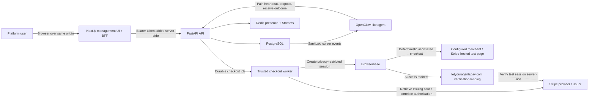
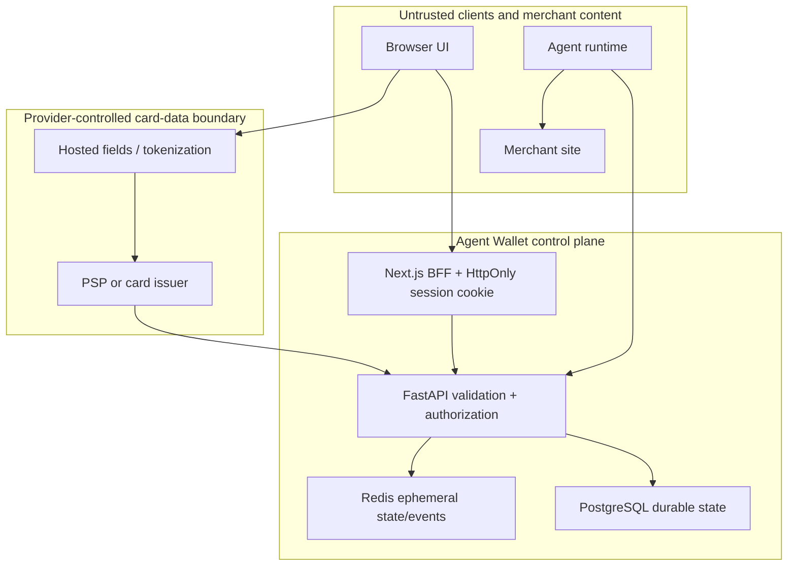

# System architecture

## Architecture at a glance

The prototype combines a responsive Next.js management application, a modular FastAPI service, and a dedicated checkout worker backed by PostgreSQL and Redis. The Next.js server is a backend-for-frontend (BFF) for human sessions and API calls. PostgreSQL is the durable source of truth for approvals, checkout jobs, human-visible checkout status histories, terminal agent events, and purchase records. Redis provides agent presence and best-effort domain-event transport. Raw card details are never stored by AG Pay and exist only transiently inside the trusted worker.



The prototype is a control plane with narrow execution adapters, not a card
vault, acquirer, or universal payment processor. An agent proposes an item and
may explicitly name an operator-configured checkout adapter and URL. Every
managed proposal waits for explicit human approval; per-agent policies can
auto-approve only unmanaged legacy proposals. For an OpenClaw managed purchase,
the tool call must carry both checkout fields; the plugin and playground do not
add defaults. Only approval of a proposal that already contains that complete
managed specification creates a durable job in the same database transaction.
A separate worker can execute a configured HTTPS merchant flow
with a Stripe Issuing reference. In development/test only, it can instead open
an offer-specific Stripe test Checkout Session URL supplied with the proposal
and drive a built-in fake card fixture through Browserbase. The allowlisted
landing server owns the Stripe credential and renders a verified receipt; the
worker does not create or poll the session. That proof does not order from the
proposal's source product URL. Proposals without managed checkout retain the
legacy sandbox/external result path: approval alone does not queue a worker or
process payment, and adding checkout fields requires a new proposal.

## Goals and tradeoffs

The architecture prioritizes:

- tenant isolation and distinct human/agent principals;
- human review by default, with explicit owner-configured and fail-safe per-agent policy evaluation;
- attributable agent/card/purchase relationships;
- one transactional database boundary while the domain evolves;
- a narrow, isolated secret path based on provider references and just-in-time retrieval;
- explicit ambiguous-outcome handling and durable agent notification;
- clear upgrade points for provider-hosted onboarding, reconciliation, and SDKs.

The worker prevents automatic retries after the irreversible submit boundary, but the prototype deliberately does not claim arbitrary-merchant support, provider-hosted card onboarding, one-time issuer limits, webhook reconciliation, device attestation, or production PCI readiness. Those remain release gates for real-world use.

## Deployable components

### Next.js management application

The web application lives at `dev/ag-pay-platform/apps/web`. It uses the Next.js App Router, React, TypeScript, Tailwind CSS, shadcn components, and TanStack Query. Its implemented management areas are:

- registration, login, local sign-out, and guarded application routes;
- an overview of setup state, agent connectivity, pending decisions, and recent purchases;
- agent creation/pairing, re-pairing, revocation, and payment-method assignment;
- safe sandbox payment-method entry for personal or business billing profiles;
- per-agent purchase-review rules with `always` as the default;
- cart review and approve/cancel decisions, ordered managed-checkout status
  timelines, active-session inspection, terminal outcome toasts, and
  re-authenticated merchant-credential reveal;
- purchase and locally tracked subscription history.

| Browser route | Management surface |
| --- | --- |
| `/login`, `/register` | Human account access |
| `/overview` | Setup progress, pending decisions, connectivity, and recent activity |
| `/approvals` | Proposed, approved, and historical review; human decisions and credential reveal |
| `/rules` | Per-agent `always`, recurrence, total-threshold, combined, or `never` review modes |
| `/agents` | Compact OpenClaw/Hermes identity cards and detail sheets for connectivity, assignments, re-pair, and revoke |
| `/cards` | Masked virtual-card presentation of safe token/reference metadata and personal/business billing profiles |
| `/purchases` | Completed purchase attribution and details |
| `/subscriptions` | Monthly/yearly commitments and local tracking status |

The browser calls same-origin `/api/auth/*` routes for session establishment and `/api/backend/*` for human operations. The BFF stores the short-lived FastAPI JWT in an `HttpOnly`, `SameSite=Lax` cookie, marks it `Secure` in production, and never returns it to browser JavaScript. It proxies only an explicit method/path allowlist, adds the bearer header server-side, disables response caching, and clears the cookie when the token expires or FastAPI returns `401`.

`AGPAY_API_URL` configures the FastAPI origin on the Next.js server and must not be exposed with a `NEXT_PUBLIC_` prefix. The BFF is a session-token containment layer, not an authorization authority: FastAPI still validates the principal and tenant scope on every operation. Web sign-out clears the cookie but does not revoke the still-valid backend JWT; revocable/refresh sessions remain future hardening.

### FastAPI service

The API lives at `dev/ag-pay-platform/apps/api` and is packaged as `ag_platform_api`. It is one deployable modular monolith with:

- route modules for auth, human agent management, agent-facing calls, payment methods/assignments, per-agent payment policies, cart decisions, and purchase/subscription history;
- Pydantic schemas for validation and secret-safe serialization;
- SQLAlchemy async models and sessions;
- Alembic migrations;
- password/token/credential security helpers;
- durable checkout queue and sanitized agent outcome routes;
- a small Redis broker and presence adapter.

Route handlers currently contain most workflow logic, while payment-policy evaluation is an explicit service. As behavior grows, the remaining approval, state-transition, and provider rules should move into domain services while database constraints remain the concurrency backstop.

### OpenClaw plugin and playground

The TypeScript integration lives in `dev/ag-plugin-openclaw`. It adapts the
versioned agent API into OpenClaw tools, a pairing CLI, and a heartbeat service;
FastAPI remains authoritative for identity, tenant scope, approval policy, card
assignment, checkout authorization, and purchase transitions. The plugin never
receives Browserbase, issuer, card, or merchant-password secrets; it polls a
PostgreSQL-backed cursor feed and injects only fixed, sanitized outcomes into
the originating OpenClaw session.

The plugin also does not choose, infer, or inject a checkout adapter or URL.
Every managed `agpay_request_purchase` call must explicitly include
`checkout_adapter` and `checkout_url`. For the hosted playground proof, the URL
is the exact offer-specific `cs_test_...#...` URL, including its fragment. If
the call omits either field, the plugin rejects it before contacting AG Pay.
Older or direct API-created records without the pair remain legacy
approval-only proposals.

The `dev/ag-openclaw-playground` repository is the local integration harness.
Its Docker build packages the sibling plugin source, installs it into a pinned
OpenClaw release, keeps tokens in SecretRef-backed storage, and exposes the
Gateway Control UI only on host loopback at `127.0.0.1:18789`. The playground
is not a production payment executor, and loading or smoke-testing the plugin
does not prove that a purchase occurred.

### PostgreSQL

PostgreSQL owns all durable users, enrollment data, token hashes, cards, assignments, per-agent payment policies, cart items, encrypted purchase credentials, checkout executions, sanitized checkout events, purchases, and subscriptions.

Important constraints include:

- unique username;
- unique provider reference per owner/provider;
- composite primary key for each agent/card assignment;
- one owner-scoped payment-policy record per agent, with threshold fields constrained to threshold modes;
- one credential and at most one purchase per cart item;
- at most one managed checkout execution and one terminal checkout event per cart item;
- an ordered status-transition history for every managed checkout execution;
- at most one subscription per purchase;
- unique provider reference per payment method;
- restrictive foreign keys for historically attributed agents, cards, cart items, and purchases.

UUIDs are external identifiers. Monetary values use fixed-precision `NUMERIC`, and timestamps are timezone aware.

### Redis

Redis has two prototype roles:

1. Agent presence keys with bounded TTL, refreshed at pairing and heartbeat.
2. A capped Redis Stream for best-effort domain events such as agent connected, card assigned, payment policy updated, cart proposed/approved, and purchase completed.

PostgreSQL remains authoritative. If Redis is unavailable, business commits are not rolled back merely because a notification cannot publish. That is suitable for UI hints but means the Stream is not a durable audit trail or guaranteed work queue.

Checkout work and OpenClaw outcome delivery do not depend on Redis. The checkout row is the durable job, and its terminal event is committed with the outcome. A general transactional outbox remains required before other best-effort events trigger financial side effects.

### pgAdmin

pgAdmin is a local-only database browser supplied by root Docker Compose. It binds to loopback by default. It is not part of the production runtime and must not be publicly exposed.

### Checkout worker, provider, and secret adapters

The dedicated worker claims PostgreSQL jobs with a lease, serializes work per
opaque Issuing card with a PostgreSQL advisory lock, connects to a fresh
Browserbase session, verifies the operator-owned merchant adapter plus exact
product title, quantity, and total, retrieves a tenant-bound Stripe Issuing
virtual card by opaque `ic_...` reference, persists the irreversible boundary
before the first card-field fill, and uses frame-bound deterministic Playwright
elements. It excludes pre-existing issuer authorizations from correlation and
retains a sanitized merchant order reference for human reconciliation.
All merchant-visible checks and submission stay on the single origin frozen by
human approval; separate configured origins are limited to reviewed resources
and payment frames.
Browserbase recording, logging, CAPTCHA solving, and context persistence are
disabled. A fresh context blocks service workers and WebSockets and routes all
page, popup, frame, and resource HTTP traffic through the adapter's exact
origin allowlist. The provider response and CDP connection URL are never
persisted or logged.

The development-only `stripe-hosted` mode uses the same queue, Browserbase
boundary, status history, and agent-event path but a different verification
authority. The approved grant contains the full offer-specific
`https://checkout.stripe.com/c/pay/cs_test_...#...` URL. The worker opens that
existing session, verifies its displayed offer facts, and fills saved billing
data plus one worker-owned Stripe test fixture. After Stripe redirects, the
`letyouragentspay.com` server uses its own test credential to verify complete
and paid state plus the expected offer, amount, and currency. The worker maps a
visible, matching verified-only receipt to `succeeded`; a definite pre-submit
failure can map to `failed`, but every non-success state after submission may
have occurred—including a visible decline or challenge—maps to
`outcome_unknown` for manual reconciliation. The worker neither creates nor
polls a Checkout Session, and arbitrary page text or a redirect alone cannot
establish payment success. One fixed URL represents only one offer.

The current worker is intentionally an integration boundary, not a production certification. Production still requires:

- a provider adapter that validates tokens and metadata server-side;
- provider-hosted onboarding and per-purchase virtual cards with issuer-enforced bounds;
- a managed secret store for merchant credentials;
- verified provider webhooks and reconciliation.

## Trust boundaries



The platform treats both human clients and agents as untrusted. The web BFF reduces browser token exposure but does not make browser requests trusted. User JWTs and opaque agent credentials are separate principal types. Submitted URLs, merchant names, rationales, provider references, receipts, and agent capability strings are untrusted input.

## Core runtime flows

### Register and authenticate

1. The browser posts the username/password to a same-origin Next.js auth route.
2. The BFF forwards the request to FastAPI; Pydantic normalizes/validates the input.
3. The backend hashes the password with the library's recommended memory-hard scheme, and PostgreSQL enforces username uniqueness.
4. FastAPI issues a short-lived JWT with `type=user`; the BFF stores it in an HttpOnly cookie and returns only safe user/session metadata.
5. Later browser calls go through the allowlisted BFF proxy. FastAPI human dependencies validate signature, expiry, type, UUID subject, active user, and resource ownership.

The prototype has no refresh sessions or verified recovery channel.

### Pair an agent

1. The human creates an agent; the API returns a short-lived `pair_...` token once and stores only its keyed digest.
2. The agent exchanges that token with its installation metadata at `/api/v1/agent/handshake`.
3. The backend row-locks and validates the agent, consumes the pairing token, stores only the digest of a new `agt_...` token, and marks the enrollment active.
4. Redis presence is set with TTL; agent heartbeats refresh it and durable `last_seen_at`.
5. The current human serializer derives `online` or `offline` from `last_seen_at` and the configured window. It does not read the Redis key, so temporary absence remains distinct from revocation even if Redis is lost.

This single-step proof-of-secret handshake meets the prototype's connectivity requirement. A signed challenge-response protocol is the next security version; see [Agent pairing and security](./agent-pairing-and-security.md).

### Attach and assign a payment method

1. The current web dialog accepts only a clearly fake/sandbox provider reference and safe display metadata; it has no full-card-number or CVC inputs.
2. A production client must instead collect raw card details through provider-hosted fields and receive an opaque token/reference.
3. The human sends only the reference, safe display metadata, and validated personal/business billing details to the API through the BFF.
4. The human assigns the active method to one or more owned agents through an idempotent association.
5. Disabling a method removes assignments and blocks later approval/completion.

Legacy payment methods remain unverified sandbox presentation data. The managed
path is the narrow exception: at execution time the trusted worker verifies an
active Stripe Issuing virtual `ic_...` reference, its safe card metadata, and
provider-owned `agpay_owner_id` tenant binding directly with Stripe. A
provider-hosted onboarding flow is still required before production.

### Configure an agent's review policy

1. Agent creation persists an owner-scoped `always` policy; `GET /api/v1/payment-policies` backfills that default for legacy agents.
2. The owner edits one agent on `/rules`; the BFF forwards `PATCH /api/v1/agents/{agent_id}/payment-policy` with the human token.
3. FastAPI verifies ownership, row-locks the policy, and validates that threshold amount/currency are both present only for the two threshold modes.
4. PostgreSQL commits the new mode, then the API publishes a best-effort `agent.payment_policy_updated` event.

The agent runtime cannot read or change this policy. Missing records, unusable threshold data, and threshold-currency mismatch are evaluated as requiring review.

### Propose, approve, execute, and notify

```mermaid
sequenceDiagram
    participant Agent
    participant API
    participant DB as PostgreSQL
    participant User
    participant Worker
    participant Issuer as Stripe Issuing
    participant Browserbase
    participant Merchant
    participant OpenClaw

    Agent->>API: POST /agent/cart-items
    API->>DB: Load/lock per-agent policy; calculate total
    alt Explicit managed adapter and checkout URL
        API->>DB: Store proposed item + encrypted credential
        API-->>Agent: proposed cart item
        User->>API: POST /cart-items/{id}/approve
        API->>DB: Lock item; verify assignment; approve + queue job atomically
    else Unmanaged policy requires review or no active assigned card
        API->>DB: Store proposed legacy item + encrypted credential
        API-->>Agent: proposed cart item
        User->>API: POST /cart-items/{id}/approve
        API->>DB: Lock item; select assignment; approve only (no job)
    else Unmanaged rule permits automatic approval and card is available
        API->>DB: Store approved legacy item + selected card
        API-->>Agent: approved cart item
    end
    opt Managed checkout execution exists
        Worker->>DB: Lease queued job; revalidate approval and assignment
        Worker->>Browserbase: Create non-recorded/non-logged session
        Worker->>Merchant: Verify allowlisted page, product, quantity, and exact total
        Worker->>Issuer: Retrieve virtual-card fields just in time
        Worker->>DB: Persist submit boundary
        Worker->>Merchant: Deterministic fill and final submit
        Worker->>Issuer: Correlate exact authorization
        Worker->>DB: Purchase + terminal event atomically
        OpenClaw->>API: Poll /agent/checkout-events after cursor
        API-->>OpenClaw: Sanitized terminal outcome
    end
```

The sequence above depicts the configured-merchant/Issuing rail. In the hosted
development proof, Browserbase opens the already-approved fixed Stripe test
Checkout URL and submits its hosted form. Stripe redirects to the allowlisted
landing server, which verifies the session server-side and renders the
verified-only receipt. The worker requires that receipt to match the frozen
session/order reference; the landing server has already verified the approved
offer facts. The remaining PostgreSQL,
web status, and OpenClaw event steps are identical.

The policy evaluator defaults missing/unknown policy data to review. `always`
reviews every item; recurrence and threshold modes inspect billing period and
the total `unit_price × quantity`; `never` requests no review for an unmanaged
proposal. Managed fields override every policy mode and require a human. When a
legacy rule permits automatic approval, the implementation deterministically
selects one active assigned method. Without one, the item stays `proposed`.

Cancellation is allowed from `proposed`. Human approval selects a specific
assigned card. Rule-approved legacy items appear in the same Approved queue but
never create a managed job. A manually approved legacy item behaves the same:
the approval is a control-plane decision, not a payment attempt. Checkout data
is immutable on the cart item, so an existing legacy proposal or approval
cannot be converted to managed checkout; OpenClaw must submit a new proposal
with both checkout arguments. Managed checkout rechecks assignment and exact
amount/currency, and database uniqueness prevents a second execution or
purchase row.

The execution state is `queued`, `running`, `succeeded`, `failed`, `action_required`, or `outcome_unknown`. Automatic retry is permitted only before `submitted_at`. A worker crash, network error, or unclear merchant response after that boundary becomes `outcome_unknown` and is never automatically submitted again.

## Consistency model

Current guarantees:

- row locks serialize cart approval, cancellation, and completion;
- owner-scoped policy updates are row locked, and new-agent/missing-policy defaults are `always`;
- proposal evaluation and the resulting proposed/approved state commit with the encrypted credential and selected method;
- approval and managed checkout-job creation commit together;
- checkout lease, attempt count, and submit boundary are durable;
- purchase creation, optional subscription creation, and the cart transition commit together;
- managed purchase creation and a sanitized terminal agent event commit together;
- uniqueness prevents duplicate purchase rows and duplicate provider references;
- card assignment is an idempotent composite-key insert;
- database commit happens before best-effort event publication.

Required production hardening:

- persisted idempotency key plus request fingerprint on retryable mutations;
- explicit approval snapshot with amount ceiling, merchant origin, recurrence terms, and expiry;
- webhook-driven reconciliation of `outcome_unknown` and provider settlement;
- transactional outbox for all side effects;
- provider webhook deduplication and out-of-order handling.

## Failure behavior

- PostgreSQL unavailable: readiness fails and state-changing requests must not claim success.
- Redis unavailable: readiness currently fails, while domain-event publication/presence writes are best effort after business operations. Agent display still derives from PostgreSQL `last_seen_at`.
- Agent heartbeat missing: show offline after the configured window; do not revoke automatically.
- Payment method disabled/unassigned after approval: the worker fails closed before submit.
- Threshold currency mismatch or incomplete/missing policy data: require human review.
- Rule permits automatic approval but no active assigned method exists: retain `proposed` for human attention.
- Duplicate completion: database constraints return conflict rather than creating another purchase row.
- Merchant/provider timeout before submit: retry within the configured limit. At or after submit: record `outcome_unknown` and never auto-retry.
- Credential decryption key mismatch: reveal fails; preserve ciphertext and restore the correct key rather than overwriting data.

## Evolution path

Keep the modular monolith until independent scaling, ownership, or compliance needs justify a split. Likely later boundaries are identity/enrollment, approval/policy, payment execution/reconciliation, and durable audit/ledger. Database tables and Redis Stream messages are internal implementation details, not public cross-service contracts.

The current web BFF consumes the human portion of the versioned HTTP API, and the `ag-plugin-openclaw` repository consumes the agent portion. A future mobile app and broader SDK will use the appropriate contracts. Business rules remain in FastAPI so a compromised or outdated client cannot widen authorization.
