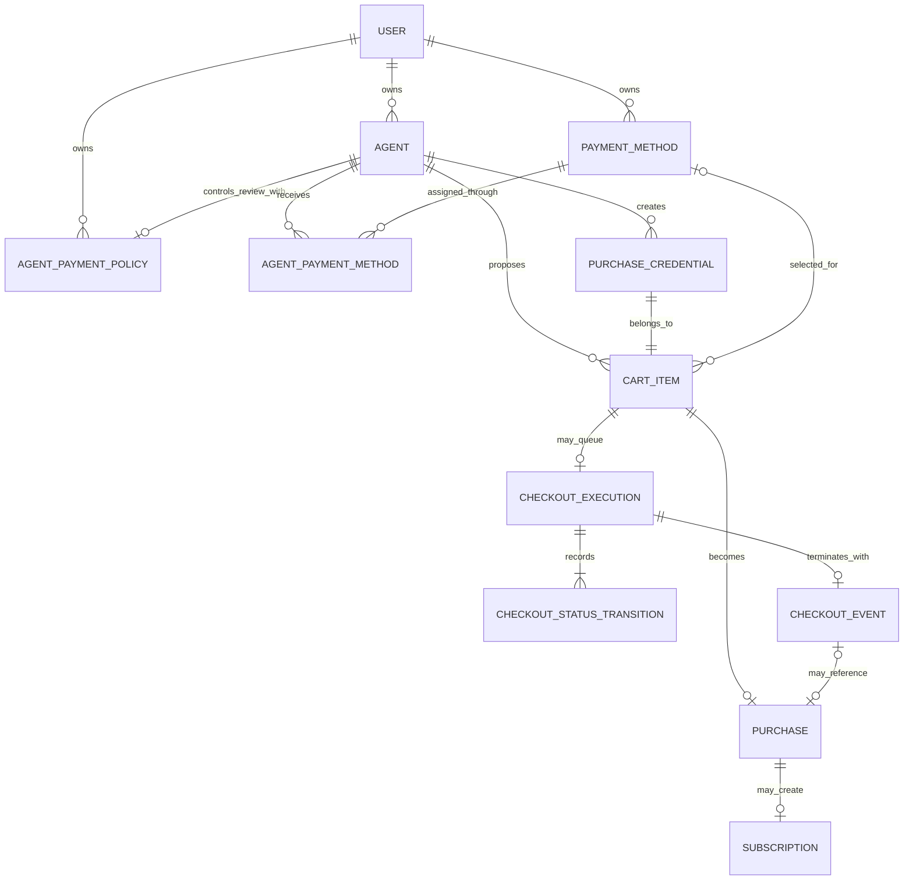
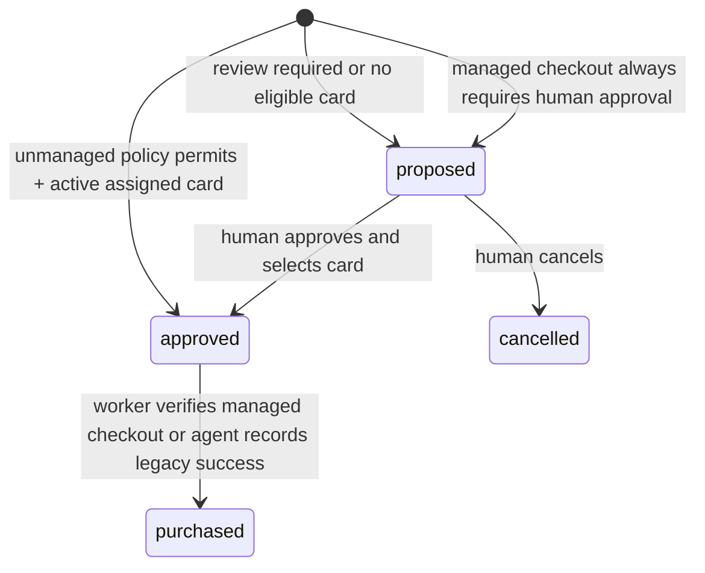
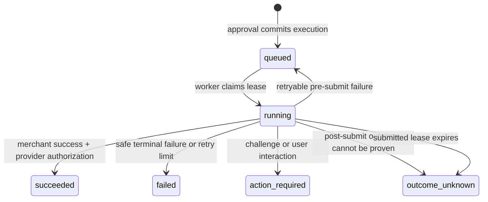

# Domain model

## Implementation status

The `0.1.0` prototype persists `User`, `Agent`, `AgentPaymentPolicy`,
`PaymentMethod`, `AgentPaymentMethod`, `PurchaseCredential`, `CartItem`,
`CheckoutExecution`, `CheckoutStatusTransition`, `CheckoutEvent`, `Purchase`,
and `Subscription`.
Personal/business billing information is embedded as a validated value object
on `PaymentMethod`.

`AgentChallenge`, reusable `MerchantAccount`, durable `AuditEvent`,
`IdempotencyRecord`, detailed `CheckoutAttempt`, and general `OutboxEvent` are
target hardening entities, not current tables. Terminal managed-checkout events
are durable in PostgreSQL; Redis Stream events remain best effort and are not a
durable audit log.

## Current relationship model

## Current entities

### User

The human tenant and authentication principal.

| Field | Meaning |
| --- | --- |
| `id` | UUID primary key |
| `username` | Unique normalized username, maximum 64 characters |
| `password_hash` | Memory-hard password hash; never plaintext |
| `is_active` | Authentication/authorization gate |
| `created_at`, `updated_at` | UTC timestamps |

Platform identity is intentionally distinct from purchase credentials used at merchants. The prototype does not require a platform email.

### Agent

One OpenClaw-like installation owned by a user.

| Field group | Representative fields |
| --- | --- |
| Ownership/display | `id`, `owner_id`, `name`, `description` |
| Enrollment | `status`, pairing-token hash/expiry, agent-token hash/expiry |
| Installation | `instance_id`, `software_version`, `capabilities` |
| Presence | `connected_at`, `last_seen_at` |
| Revocation | `revoked_at` |

Stored status is `pending`, `active`, or `revoked`. Human responses add a connection state of `pending`, `online`, `offline`, or `revoked`, derived from `last_seen_at` and the configured online window. Redis presence is written but not consulted by the current serializer.

Pairing-token and agent-token plaintext is never persisted. A token is disclosed once at creation/exchange.

### AgentPaymentPolicy

The owner-controlled, one-per-agent rule for deciding whether a new cart item waits for human review.

| Field | Meaning |
| --- | --- |
| `id`, `owner_id`, `agent_id` | UUID identity plus tenant/agent attribution |
| `mode` | `always`, `subscriptions_only`, `above_amount`, `subscriptions_or_above_amount`, or `never` |
| `threshold_amount` | Optional non-negative `NUMERIC(18,2)` used only by amount modes |
| `threshold_currency` | Optional uppercase three-letter currency used only by amount modes |
| `created_at`, `updated_at` | UTC timestamps |

New agents receive `always`. The list endpoint creates the same default for a legacy agent without a record, while the evaluator also treats a missing policy as `always`. The unique `agent_id` enforces at most one record per agent. Database and request constraints require both threshold fields for the two amount modes and prohibit them for the other modes.

The evaluator compares the cart total `unit_price × quantity`, not unit price. “Above” is strict: a total equal to the threshold does not require review. A threshold-currency mismatch or unusable threshold fails safe to review. `never` means the control plane does not request human review; it is not an issuer authorization or an unbounded real-money permission.

### PaymentMethod

A provider-tokenized card reference plus safe display metadata and billing details.

| Field group | Representative fields |
| --- | --- |
| Ownership/display | `id`, `owner_id`, `display_name`, `status` |
| Provider | `provider`, `provider_payment_method_id` |
| Safe card metadata | `card_brand`, `card_last4`, `expiry_month`, `expiry_year` |
| Billing | `billing_profile_type`, `billing_details` JSON |

Status is `active` or `disabled`. The unique `(owner_id, provider, provider_payment_method_id)` constraint prevents duplicate attachment for one user. No PAN or CVC columns exist.

`billing_profile_type` is `personal` or `business`. The validated details contain:

- personal: full name, email, optional phone, and address;
- business: legal name, VAT number, optional registration number, contact name/email/phone, and address.

Country is an ISO alpha-2 code. VAT normalization and external verification are not implemented yet. Storing billing details as JSON accelerates the prototype but separate profile/address tables may be preferable when profiles become reusable or country validation expands.

### AgentPaymentMethod

The many-to-many authorization between an agent and a card.

The composite primary key `(agent_id, payment_method_id)` makes assignment idempotent. Creation verifies both resources share the current user. Removing an assignment blocks new approval/completion but preserves attribution through direct purchase references.

One card can serve many agents and one agent can have many cards.

### PurchaseCredential

The external merchant login created or used for one cart item, allowing the human to access the merchant after purchase.

| Field | Meaning |
| --- | --- |
| `id`, `owner_id`, `agent_id` | Identity and attribution |
| `email` | Merchant account email |
| `encrypted_password` | Fernet-encrypted password; not serialized normally |
| `login_url` | Optional merchant sign-in URL |

Each `CartItem` has exactly one credential and each credential belongs to one item. This implements the per-purchase account requirement without assuming merchant identities are safely reusable. A future reusable `MerchantAccount` may normalize credentials by canonical merchant origin.

### CartItem

The atomic cart, rationale, and human-decision unit.

| Field group | Representative fields |
| --- | --- |
| Attribution | `id`, `owner_id`, `agent_id`, `credential_id` |
| Product | `title`, `description`, `product_url`, optional `merchant`, `quantity` |
| Managed checkout | optional `checkout_adapter` and `checkout_url` |
| Rationale | `reason` |
| Proposal | `unit_price`, `currency`, optional `billing_period` |
| Decision | `status`, `selected_payment_method_id`, `decision_note`, `approved_at`, `cancelled_at` |
| Timestamps | `created_at`, `updated_at` |

The total is derived as `unit_price × quantity`. `billing_period` is `monthly`,
`yearly`, or absent. A human can select only an active payment method currently
assigned to the originating agent. An unmanaged, policy-eligible item can start
as `approved` only when the backend finds an active assigned method; otherwise
it starts as `proposed`. A managed item always starts as `proposed`.

Current state machine:

Rule-approved legacy items and manually approved items share the same persisted
cart state. If both managed-checkout fields are present, only human approval
transactionally creates one execution; otherwise the item retains the legacy
external-completion path.
`cancelled` and `purchased` are terminal cart states.

### CheckoutExecution

The durable, one-per-cart-item managed checkout job and authorization snapshot.

| Field group | Representative fields |
| --- | --- |
| Attribution | `id`, `owner_id`, `agent_id`, `cart_item_id`, `payment_method_id` |
| Frozen grant | `adapter_key`, `adapter_config`, `approved_amount`, `currency`, `checkout_origin` |
| Worker state | `status`, `attempt_count`, `lease_expires_at`, `submitted_at` |
| Safe result | `completed_at`, `error_code`, fixed `error_message`, optional `merchant_order_reference` |
| Human operations | optional `browserbase_session_id` (human API only) |

`cart_item_id` is unique. Status is `queued`, `running`, `succeeded`, `failed`,
`action_required`, or `outcome_unknown`. Approval snapshots operator-owned
adapter selectors and origins so later configuration edits cannot silently
broaden an already approved grant.

For the development-only `stripe-hosted` adapter, the frozen configuration also
records `checkout_mode=stripe_hosted_test`. The approved
`https://checkout.stripe.com/` URL is only a validated bootstrap origin; the
worker creates and validates the execution-specific `cs_test_...` session after
approval. Its safe Checkout Session ID can become the human-only merchant order
reference, while the bound PaymentIntent reference remains internal provider
evidence.

The current execution model supports one-time purchases only. A cart item with
a billing period cannot create a managed execution; recurring records remain a
legacy sandbox/external flow until the merchant interval and renewal amount can
be verified.

The lease lets another worker recover a stale pre-submit execution. Once
`submitted_at` exists, stale recovery terminates as `outcome_unknown`; it never
replays the merchant submission. `browserbase_session_id` exists only for
trusted operational correlation; it is exposed only in the tenant-scoped human
execution summary and is absent from agent responses and checkout events.
Executions using the same opaque card reference are additionally serialized by
a PostgreSQL advisory lock through issuer reconciliation and the terminal
database commit.
An `action_required` or `outcome_unknown` sibling quarantines that payment
method from later managed execution until an operator reconciles and replaces
or disables it.

### CheckoutStatusTransition

The append-only, human-visible lifecycle history for one checkout execution.
The approval transaction appends `queued`; every worker claim appends `running`;
a safe pre-submit retry appends another `queued`; and the outcome transaction
appends `succeeded`, `failed`, `action_required`, or `outcome_unknown`.

Each row stores a monotonic sequence, its execution ID, status, attempt count,
optional sanitized error code, and UTC occurrence time. Tenant ownership is
derived from the foreign-keyed execution rather than duplicated on the row.
Tenant-scoped human cart reads return the ordered history with fixed safe error
text. Agent cart responses do not expose this operational history; the separate
`CheckoutEvent` remains the agent's one-terminal-event feed.

### CheckoutEvent

The append-only terminal managed-checkout outcome consumed by the originating
agent integration.

| Field group | Representative fields |
| --- | --- |
| Cursor/identity | monotonic `cursor`, unique `event_id`, unique `execution_id` |
| Scope | `owner_id`, `agent_id`, `cart_item_id`, optional `purchase_id` |
| Safe result | terminal `status`, `amount`, `currency`, optional `error_code`, `created_at` |

The unique execution reference makes one logical terminal event per execution.
The agent endpoint scopes by authenticated `agent_id` and orders by cursor.
No merchant-controlled error string, Browserbase identifier, provider card
reference, or payment credential is present.

### Purchase

The record created when either the trusted worker verifies managed checkout or
the originating agent reports a legacy sandbox/external completion.

| Field group | Representative fields |
| --- | --- |
| Attribution | `id`, `owner_id`, `agent_id`, `cart_item_id`, `payment_method_id` |
| Result | `status`, `amount`, `currency`, `provider_reference`, optional `merchant_order_reference`, optional `receipt_url` |
| Time | `purchased_at`, `created_at`, `updated_at` |

`cart_item_id` is unique, preventing more than one purchase row per item. `(payment_method_id, provider_reference)` is also unique. Current statuses are `completed`, `failed`, and `refunded`, although the implemented completion route creates only `completed`.

The human purchase response is assembled with the source cart item's product
and account-email snapshot. A sanitized merchant order reference supports
manual reconciliation; it is intentionally absent from the OpenClaw event.
Deleting an agent/card referenced by purchases is restricted or converted to a
soft state change.

### Subscription

A recurring commitment created automatically when a purchased cart item has a billing period.

| Field | Meaning |
| --- | --- |
| `id`, `owner_id`, `agent_id`, `purchase_id` | Identity and attribution |
| `billing_period` | `monthly` or `yearly` |
| `status` | `active`, `paused`, or `cancelled` |
| `next_billing_at` | Optional locally known renewal timestamp |

There is at most one subscription per purchase. Updating status tracks the platform's knowledge only; it does not execute an action at the merchant.

## Invariants

- Every human-managed query is scoped to the authenticated owner's ID.
- Every agent request derives the agent and owner from the opaque credential.
- An agent and assigned payment method must share the same owner.
- Each policy belongs to the same owner as its agent; an agent credential cannot read or mutate policies.
- Missing policy data, invalid threshold data, and threshold-currency mismatch require review.
- Automatic approval requires an active assigned payment method; without one the item remains proposed.
- Only an active assigned method can approve or execute a cart item.
- Only the originating agent can record a legacy completion; managed completion
  belongs exclusively to the trusted worker.
- Final amount and currency must exactly equal the proposal.
- One managed execution exists per cart item and is created in the same
  transaction as approval.
- A worker revalidates tenant, agent, assignment, method state, adapter, URL,
  and the merchant-displayed product title, quantity, amount, and currency
  before retrieving a card and immediately before submission.
- A managed checkout is retried only before `submitted_at`; ambiguous
  post-submit outcomes are never automatically retried.
- Every managed execution state change is appended transactionally to its
  tenant-scoped status history.
- Each managed execution emits at most one durable terminal event.
- One cart item creates at most one purchase; one purchase creates at most one subscription.
- Disabling a payment method removes its active assignments but does not erase history.
- Revoking an agent clears its authentication material but does not erase purchase history.
- Merchant passwords are encrypted and excluded from ordinary serializers.

## Money, URLs, and time

- Money is stored as `NUMERIC(18,2)` and represented as a fixed-precision decimal plus uppercase three-letter currency. Binary floating-point storage is prohibited.
- Two decimal places make the prototype appropriate for common fiat currencies but not every ISO currency. A production currency table or integer minor-unit model is required for zero- and three-decimal currencies.
- Product and login URLs are validated as absolute HTTP(S) URLs and are not
  fetched by FastAPI.
- A managed checkout URL must be HTTPS, use an operator-allowlisted public
  origin, and remain within the adapter's merchant/payment-frame origins.
- Merchant display identity remains a string; the execution authorization uses
  the normalized checkout origin instead.
- Persisted timestamps use timezone-aware UTC and APIs emit an explicit offset.

## Managed execution lifecycle

`outcome_unknown` is essential: automatically retrying an ambiguous checkout
can double charge the user. It has no automated outgoing transition. An
operator must reconcile merchant and issuer records before any separate retry
or corrective action.

## Target supporting entities

- `IdempotencyRecord`: principal, endpoint, opaque key, canonical request hash, prior response, expiry.
- `CheckoutAttempt`: immutable per-attempt details and reconciliation evidence;
  status transitions are now retained, but DOM/provider evidence and detailed
  per-attempt timings are not.
- `OutboxEvent`: durable event written in the same transaction as business state, later published to Redis/another broker.
- `AuditEvent`: append-only actor, action, resource, result, correlation ID, redacted metadata, timestamp.
- `AgentChallenge`: single-use nonce and public key for proof-of-possession pairing.
- `MerchantAccount`: optional reusable merchant origin/email/secret reference, if reuse is intentionally supported.
